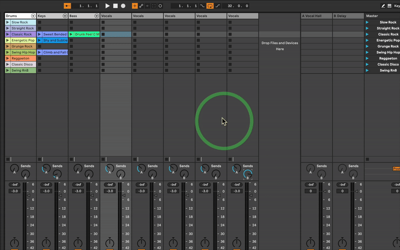

# MouseCircle

A macOS menu bar app that shows a circle around your mouse cursor.

## Features

- Works with multiple displays
- Two animation types: Ripple and Pulse
- Adjustable circle size, thickness, and color
- Customizable animation intensity
- Lives in the menu bar

## Installation

- For now you'll have to build this yourself in Xcode...

## Usage

Click the circle icon in your menu bar to:
- Adjust circle size and thickness
- Change animation intensity
- Pick circle color
- Switch between Ripple and Pulse animations

## Requirements

- macOS 10.15 or later
- Xcode for building

## License

