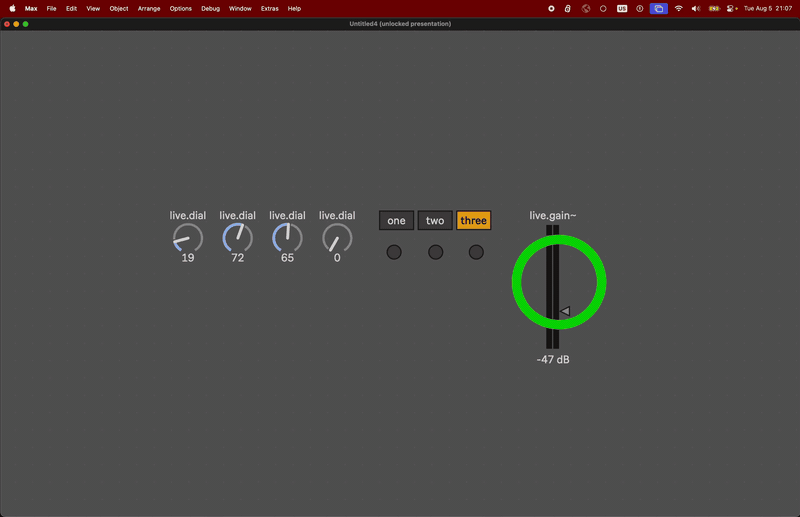

# Mouse Circle

A tiny macOS menu bar app that draws a circle around your mouse cursor, on top of everything else on screen.



Handy when other people need to follow your pointer:

- Presentations and live demos
- Screen recordings and tutorial videos
- Remote screen sharing and pair programming
- Eye-tracker or voice-control setups such as [Talon](https://talonvoice.com/), where you want clear feedback on where the cursor is

## Features

- Lives in the menu bar, no Dock icon
- Sits above full-screen apps, menus, the Dock and the menu bar, so it never disappears
- Works across multiple displays, including a circle straddling two screens
- Click feedback, set separately for left and right clicks: **Ripple**, **Pulse**, **Flash** or none
- Adjustable size, thickness, colour (with opacity) and animation intensity
- Global keyboard shortcut (⌃⌥⌘M by default): tap to hide or show the circle, hold to hide it only while the key is down
- Remembers your settings between launches

## Install

Grab the latest build from [Releases](../../releases), unzip, and drag **Mouse Circle** to your Applications folder.

Or build it yourself: open `Mouse Circle.xcodeproj` in Xcode and press Run. Requires macOS 15 or later.

No special permissions are needed. The app only listens for mouse movement and clicks, never keystrokes.

## Usage

Click the ring icon in the menu bar to adjust the circle. Everything updates live while the menu is open.

Press ⌃⌥⌘M to hide or show the circle from anywhere. Hold the shortcut instead of tapping it and the circle only flips while the key is down, coming back when you let go. Choose **Keyboard Shortcut…** in the menu to record a different key.

## Development

Open `Mouse Circle.xcodeproj` and press Run. Tests live in two targets: **Mouse CircleTests** runs inside the real app and drives the menu, overlay windows, colour panel and shortcut directly, and **Mouse CircleUITests** launches the app and clicks through the menu bar like a user. Run both with Cmd+U in Xcode, or:

```
xcodebuild test -project "Mouse Circle.xcodeproj" -scheme "Mouse Circle" -destination 'platform=macOS'
```

## License

GPL-3.0. See [LICENSE](LICENSE).
